# JustAsk Platform - Architecture

**Last Updated:** 2025-12-30

---

## System Overview

This is a **4-project AI Intelligence System** that demonstrates end-to-end capabilities from data discovery through intelligent model selection to user-facing applications.

### The Four Projects

1. **justask-registry** (Discovery Pipeline)
   - Python-based automated pipelines
   - 3 separate pipelines: OpenRouter (19 stages), Google (8 stages), Groq (10 stages)
   - Fetches, enriches, and deploys model metadata to Supabase
   - Runs daily via GitHub Actions
   - Current dataset: 50+ models

2. **justask-dashboard** (Visualization Dashboard)
   - React 18 + TypeScript + Chart.js
   - Real-time visualization of 50+ models
   - Reads directly from Supabase `ai_models_main` table
   - Deployed to GitHub Pages
   - Auto-refreshes every 5 minutes

3. **justask-router** (Selection Microservice)
   - Node.js Express service
   - Multi-factor scoring algorithm (5 weighted factors)
   - 4-metric rate limit tracking (RPM, RPD, TPM, TPD)
   - 4-table architecture (working_version + mappings + metrics + rate_limits)
   - 5-6ms selection latency
   - Port 3001

4. **justask** (Mobile App + Backend)
   - React Native (Expo) frontend for Android
   - Node.js Express backend on Render (Port 3000)
   - Keyword-based query classification
   - Calls justask-router for optimal model
   - Multi-provider failover (Gemini -> Groq -> OpenRouter)
   - Offline queueing with SQLite

---

## Data Flow Diagram

```mermaid
graph TB
    %% External APIs
    OpenRouterAPI[OpenRouter API<br/>REST + WS]
    GoogleAPI[Google AI API<br/>Gemini]
    GroqAPI[Groq API<br/>REST + WS]
    AAAPI[Artificial Analysis API<br/>Performance Metrics]

    %% Pipelines
    OpenRouterPipeline[OpenRouter Pipeline<br/>19 stages A-S<br/>Fetch -> Parse -> Enrich<br/>Validate -> Transform -> Deploy]
    GooglePipeline[Google Pipeline<br/>8 stages A-H<br/>Fetch -> Parse -> Enrich<br/>Validate -> Transform -> Deploy]
    GroqPipeline[Groq Pipeline<br/>10 stages A-J<br/>Fetch -> Parse -> Enrich<br/>Validate -> Transform -> Deploy]

    %% Database Tables
    WorkingVersion[(public.working_version<br/>Staging Table<br/><br/>Method: DELETE by provider<br/>+ INSERT new<br/><br/>Scripts: T_refresh, G_refresh,<br/>H_refresh)]

    AiModelsMain[(public.ai_models_main<br/>Production Table<br/><br/>Method: BACKUP + DELETE<br/>+ INSERT from working_version<br/><br/>Scripts: U_deploy, H_deploy,<br/>I_deploy)]

    ModelAAMapping[(ims.10_model_aa_mapping<br/>Mapping Table<br/><br/>Method: UPSERT<br/>INSERT ON CONFLICT DO UPDATE<br/><br/>Maps: inf_provider, provider_slug<br/>-> aa_slug<br/><br/>Scripts: refresh_model_aa_mapping)]

    AAPerformance[(ims.20_aa_performance_metrics<br/>EXTERNAL SOURCE<br/><br/>Source: Artificial Analysis API<br/>Weekly ETL - script NOT in codebase<br/><br/>- aa_slug PK<br/>- intelligence_index<br/>- coding_index, math_index<br/>- name)]

    RateLimits[(ims.30_rate_limits<br/>Parsed from working_version<br/><br/>Source: working_version.rate_limits<br/>Method: Text parsing<br/><br/>- human_readable_name PK<br/>- rpm, rpd, tpm, tpd<br/>- raw_string, parseable)]

    %% Services
    AiLand[justask-dashboard<br/>React + Vite<br/>GitHub Pages<br/><br/>Query: SELECT * FROM ai_models_main<br/>Refresh: 5-min<br/><br/>EXCLUSIVE CONSUMER]

    ModelSelector[justask-router<br/>Node.js Microservice<br/><br/>4-table client-side JOIN:<br/>1. working_version<br/>2. ims.10_model_aa_mapping<br/>3. ims.20_aa_performance_metrics<br/>4. ims.30_rate_limits<br/><br/>5-Factor Scoring:<br/>Intelligence 35%, Latency 25%<br/>Rate Limit 25%, Geography 10%<br/>License 5%<br/><br/>Cache: 30-min TTL<br/>Response: 5-6ms]

    APIGateway[PLACEHOLDER: API Gateway<br/>- Rate limiting<br/>- Request routing<br/>- Authentication]

    JustaskBackend[justask API<br/>Node.js + Express<br/><br/>- Model Router<br/>- Query Processor<br/>- Failover: Gemini->Groq->OpenRouter<br/>- Offline Queue<br/>- Response Cache]

    ResponseSanitizer[PLACEHOLDER: Response Sanitizer<br/>- Output validation<br/>- Content filtering]

    JustaskMobile[justask App<br/>React Native + Expo<br/><br/>- Chat Interface<br/>- Local State<br/>- Offline Support]

    EndUser[END USER<br/>Mobile/Web]

    %% Data Flows
    OpenRouterAPI -->|Raw JSON| OpenRouterPipeline
    GoogleAPI -->|Raw JSON| GooglePipeline
    GroqAPI -->|Raw JSON| GroqPipeline

    OpenRouterPipeline -->|Validated data<br/>50+ models total| WorkingVersion
    GooglePipeline -->|Validated data| WorkingVersion
    GroqPipeline -->|Validated data| WorkingVersion

    WorkingVersion -->|BACKUP + DELETE<br/>+ INSERT| AiModelsMain
    WorkingVersion -->|provider_slug<br/>source data| ModelAAMapping
    WorkingVersion -->|Parse rate_limits field| RateLimits

    AAAPI -->|Weekly ETL<br/>Metrics JSON| AAPerformance

    AAPerformance -->|aa_slug list<br/>target for matching| ModelAAMapping

    AiModelsMain -->|SELECT *<br/>5-min refresh| AiLand

    ModelAAMapping -->|aa_slug mapping| ModelSelector
    AAPerformance -->|Intelligence scores| ModelSelector
    RateLimits -->|Rate limit data| ModelSelector
    WorkingVersion -->|Base model data| ModelSelector

    ModelSelector -->|POST /select-model| APIGateway
    APIGateway --> JustaskBackend
    JustaskBackend -->|WebSocket + REST| ResponseSanitizer
    ResponseSanitizer --> JustaskMobile
    JustaskMobile --> EndUser

    %% Styling
    classDef apiStyle fill:#e1f5ff,stroke:#01579b,stroke-width:2px,color:#000
    classDef pipelineStyle fill:#fff3e0,stroke:#e65100,stroke-width:2px,color:#000
    classDef tableStyle fill:#f3e5f5,stroke:#4a148c,stroke-width:2px,color:#000
    classDef serviceStyle fill:#e8f5e9,stroke:#1b5e20,stroke-width:2px,color:#000
    classDef placeholderStyle fill:#ffebee,stroke:#b71c1c,stroke-width:2px,stroke-dasharray: 5 5,color:#000

    class OpenRouterAPI,GoogleAPI,GroqAPI,AAAPI apiStyle
    class OpenRouterPipeline,GooglePipeline,GroqPipeline pipelineStyle
    class WorkingVersion,AiModelsMain,ModelAAMapping,AAPerformance,RateLimits tableStyle
    class AiLand,ModelSelector,JustaskBackend,JustaskMobile,EndUser serviceStyle
    class APIGateway,ResponseSanitizer placeholderStyle
```



---

## Key Data Flows

### 1. Daily Discovery Cycle
- **Trigger**: GitHub Actions at 00:00 UTC
- **Process**: 3 pipelines run in parallel
  - OpenRouter: 19 stages (A-U)
  - Google: 8 stages (A-H)
  - Groq: 10 stages (A-J)
- **Output**: Updated `ai_models_main` table in Supabase
- **Downstream**: All consumers automatically see fresh data

### 2. Intelligent Selection Process
1. justask API receives user query
2. Classifies query type (news, creative, general_knowledge)
3. Calculates complexity score (0.0-1.0)
4. Calls justask-router microservice (port 3001)
5. Selector applies 5-factor algorithm:
   - Intelligence Index (35%) - Performance from Artificial Analysis
   - Latency (25%) - Provider speed (Groq > Google > OpenRouter)
   - Rate Limit Headroom (25%) - Available capacity (min of 4 metrics)
   - Geography (10%) - US providers preferred
   - License (5%) - Open source bonus
6. Returns optimal model + metadata
7. Backend executes LLM call to selected provider

### 3. Multi-Layer Resilience
- **Rate limit intelligence**: Distributes load based on available headroom
- **Failover chain**: Primary -> Groq -> OpenRouter
- **Offline queueing**: Mobile app stores queries in SQLite when offline
- **Cache layers**:
  - Models cache: 30-minute TTL
  - Response cache: 7-day TTL (privacy-first)
- **Health monitoring**: All services expose `/health` endpoints

### 4. Privacy & Security
- **API keys**: Stored in Supabase Vault, never in client code
- **justask app**: No history persistence, local cache only
- **justask-dashboard**: Uses anon key (read-only access)
- **RLS policies**: Row-level security enforces access controls
- **Proxy pattern**: justask/api acts as secure gateway

---

## Database Architecture

**Supabase Tables**:
- `public.working_version`: 50+ models (pipeline-managed, read-only)
- `ims.model_aa_mapping`: 35 performance mappings (49% coverage)
- `ims.aa_performance_metrics`: 337 models with Intelligence Index
- `ims.rate_limits`: 56 models with normalized rate limits (RPM, RPD, TPM, TPD)

**Data Flow**:
```
justask-registry -> working_version -> justask-router
                                    -> justask-dashboard
```

---

## Deployment Status

| Project | Status | Platform |
|---------|--------|----------|
| justask-registry | Live | GitHub Actions (daily cron) |
| justask-dashboard | Live | GitHub Pages |
| justask-router | Ready | Render.com |
| justask API | Deployed | Render.com |
| justask app | In development | Android APK |

---

## Key Metrics

- **50+ models** discovered and enriched daily
- **3 provider pipelines** (OpenRouter, Google, Groq)
- **5-6ms** selection latency (20x better than 100ms target)
- **4-metric** rate limit tracking per model
- **100% automated** via GitHub Actions
